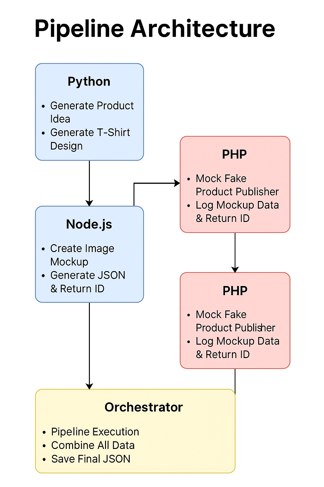

# AI Merch Maker Lite – Final Submission

## Overview
AI Merch Maker Lite is an automated pipeline that:
1. **Generates funny merch ideas for programmers** (via Python + Hugging Face API).
2. **Creates a t-shirt mockup** (via Node.js + Canvas).
3. **Publishes the product to a fake publisher** (via PHP).
4. **Runs automatically every day** (via Python Scheduler).

This project was developed as part of an internship assignment.

---

## Features
✔ Fully automated **end-to-end pipeline**  
✔ **Daily automated runs** via Python scheduler (`daily_runner.py`)  
✔ **Modular structure** for Python, JS, PHP, and Orchestrator  
✔ Auto-opens the generated **mockup image in the browser**  
✔ Clean **Printful-like mockup UI simulation**  
✔ **Professional JSON outputs** saved at every step

---

## Tech Stack
- **Python 3.10+** – Hugging Face API integration, orchestration, scheduler
- **Node.js + Express + Canvas** – Mockup generator & simulation UI
- **PHP 8** – Fake Product Publisher endpoint
- **HTML/CSS** – Upload simulation UI

---

## Architecture Diagram



**Pipeline Flow**:
1. **Python →** Generates product idea & t-shirt design.  
2. **Node.js →** Creates mockup image and Printful-style JSON.  
3. **PHP →** Fake product publisher logs the mockup data & returns a fake product ID.  
4. **Orchestrator →** Combines all data and saves the final product JSON.

---

## Folder Structure

```
ai-merch-maker-lite-main/
│
├── python/                    # Product idea & image generator
│   ├── ai_content_generator.py
│   ├── file_manager.py
│   ├── config.py
│   ├── utils.py
│   └── sample_outputs/
│       ├── product.json
│       └── product.png
│
├── js/                        # Mockup Generator
│   ├── server.js
│   ├── routes/
│   ├── controllers/
│   ├── public/
│   │   ├── index.html
│   │   └── style.css
│   └── output/
│       ├── mockup.json
│       └── mockup.png
│
├── php/                       # Fake Publisher
│   ├── fake_publisher.php
│   └── received_product.json
│
├── orchestrator/              # Full Pipeline Orchestrator
│   ├── run_pipeline.py
│   ├── daily_runner.py
│   ├── config.py
│   ├── python_runner.py
│   ├── js_runner.py
│   ├── php_publisher.py
│   └── utils.py
│
└── sample_outputs/
    └── final_product.json
```

---

## How to Run

### **1. Install Requirements**
**Python:**
```bash
pip install -r requirements.txt
```
(Contains `requests`, `schedule`, etc.)

**Node.js:**
```bash
cd js
npm install
```

---

### **2. Run Pipeline Manually**
1. Start PHP server:
```bash
cd php
php -S localhost:8000
```

2. Run the orchestrator:
```bash
cd orchestrator
python3 run_pipeline.py
```

---

### **3. Enable Daily Automation**
Run the daily scheduler (keeps running in background):
```bash
cd orchestrator
python3 daily_runner.py
```
Runs **every day at 10:00 AM** automatically.

To change time: edit in `daily_runner.py`:
```python
schedule.every().day.at("10:00").do(run_daily_pipeline)
```

---

## Outputs

- **`python/sample_outputs/product.json`** → Product idea  
- **`js/sample_outputs/mockup.png`** → Mockup image  
- **`php/received_product.json`** → Logged fake publish data  
- **`sample_outputs/final_product.json`** → Final combined product data

---

## Sample Final JSON

```json
{
  "product_idea": {
    "title": "404: Social Life Not Found",
    "description": "A minimalist t-shirt featuring a browser-style 404 error...",
    "tags": ["programmer humor", "404 joke", "coding life", "debugging", "geek fashion"]
  },
  "mockup_data": {
    "mockup_url": "/sample_outputs/mockup.png",
    "product_id": "mock567",
    "variant": "t-shirt"
  },
  "publisher_response": {
    "status": "success",
    "product_id": "fake-prod-4821"
  }
}
```

---

## Author
**Developed by:** *Keerthana G*  
**For:** *Internship Assignment – AI Merch Maker Lite*
